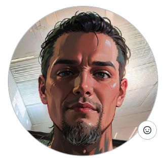

<h1 align="center">
   
  
   
  Lekszikov Miklos
   
</h1>
<h4 align="center">Warframe Cross Platform Project</h4>

  
  

## License

This project is licensed under the MIT License - see the [LICENSE](LICENSE) file for details.

<picture> </picture> 

Cross Platform  
``MacOS`` ``Windows`` ``Linux`` ``iOS``  

<picture></picture>
> Látogasson el a [IOS App](https://github.com/LexyGuru/Warframe_Api_IOS) oldalra  
> Látogasson el a [MacOS App](https://github.com/LexyGuru/Warframe_Api_MacOS) oldalra  
> Látogasson el a ~~Windows / Linux App~~ oldalra  

   
<picture> </picture> 
A programok jelenleg fejlesztés és tesztelés alatt állnak. Az alkalmazások alapfunkciókkal rendelkeznek, ezért előfordulhatnak hibák, így mindenki saját felelősségére és ennek tudatában használja a programokat. Bármilyen adatvesztésért vagy egyéb károkért felelősséget nem vállalok.    

## Keresés

> ``Warframe Wiki``  
> ``Item Drop infok``  
> ``Warframe Drop infok`` 

## Ciklusok

> ``Void Fissures``  
> ``Sortie``  
> ``Nightwave``  
> ``Ciklusok``  
> ``Archon Hunt``  
> ``Arbitration``  
> ``Baro Ki'Teer`` 

## Események

## Update Infok

> ``MacOS`` 

[Swift App]  
[Python Qt6 App]  

> ``Windows`` / ``Linux`` 

[Python Qt6 App]  

> ``iOS`` **NOT LICENSE XCODE**
 
[Swift App]  

